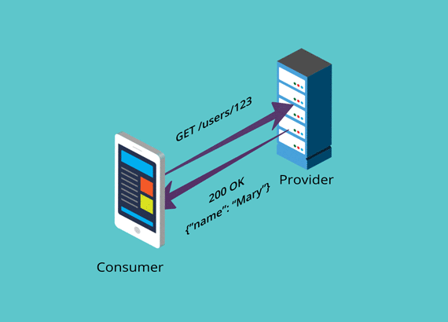

Matt Fellows describes CDC this way.

> What is consumer-driven contract testing?
The "consumer-driven" prefix simply states an additional philosophical position that advocates for better internal microservices design by putting the consumers of such APIs at the heart of the design process. Provider-driven APIs tend to be biased towards the data that is being exposed and the system that is exposing it.

>Pact and Spring Cloud Contracts are examples of frameworks that default to this kind of implementation, but this isn't a requirement to get the key benefits of contract-testing and both can be used to achieve the aims of contract testing.

>-- Matt Fellows, [What is contract testing and why should I try it?](https://pactflow.io/blog/author/matt/)

You are encouraged to read more, especially here:

[How Pact Works](https://docs.pact.io/how-pact-works)

But, for now, let's get working with this scenario.
