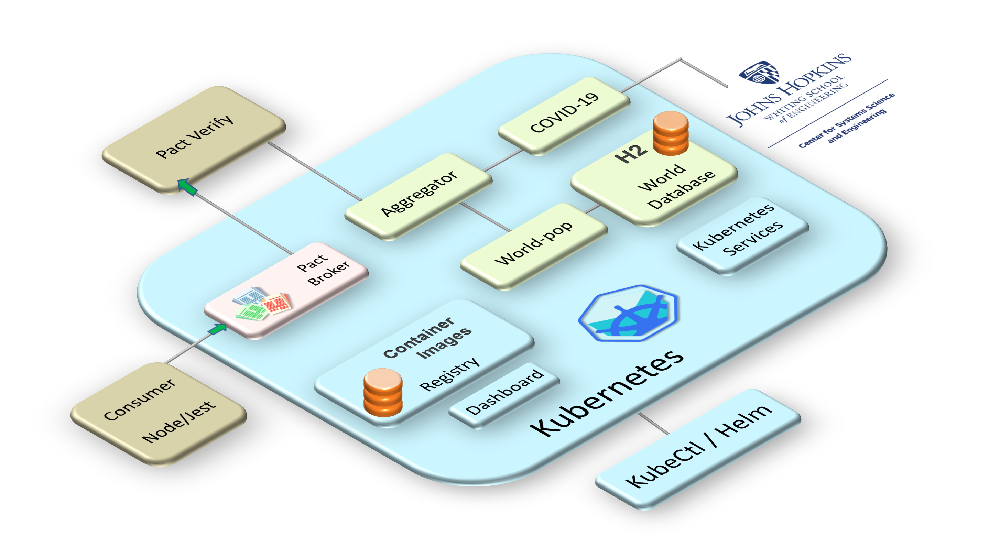

You will build and deploy all the source code for this scenario. To save time and stay focused on Pact, the source code is pre-written, but you will build and deploy it to experience the "feel" of the development workflow. There are a variety of ways to organize the workflows, this scenario shows the basic approach.

## About the application

## Clone source code

All of the code is in a single git repository. Clone the repo into this scenario.

`git clone https://github.com/javajon/cdc-with-k8s`{{execute}}

`cd ~/cdc-with-k8s`{{execute}}

## Application architecture

Orient yourself with the source structure.

`tree -d -L 2`{{execute}}

There are 6 directories with these purposes.

| Directory Name  | Purpose                                                |
|-----------------|--------------------------------------------------------|
| aggregator      | Public API gateway, aggregates data from world-pop and covid-19 microservices. This is the API you will test with Pact. |
| cluster         | A collection of Kubernetes YAML based manifests that define how each microservice, Pod, Deployment, and Service will run on your Kubernetes cluster. |
| covid-19        | A microservice that serves the covid-19 data, updated daily, for each country on our blue marble. |
| h2-seeder       | A small container that runs as an _initContainer_ that seeds the H2 database Pod when it starts. The data is the human population for all the countries and major cities on our blue marble. |
| pact            | Here is one consumer. The Node.js code is independent of the Kubernetes cluster and by running a Pact test it creates a Pact contract |
| world-pop       | A microservice that serves the world population data found in the H2 database. |

In summary, the aggregator serves data combining the daily COVID-19 metrics with the world population. Here is a networking representation Pods relationships.

In the following steps, you will go into each directory where you will build, tag, push, and start each container on your Kubernetes cluster.
