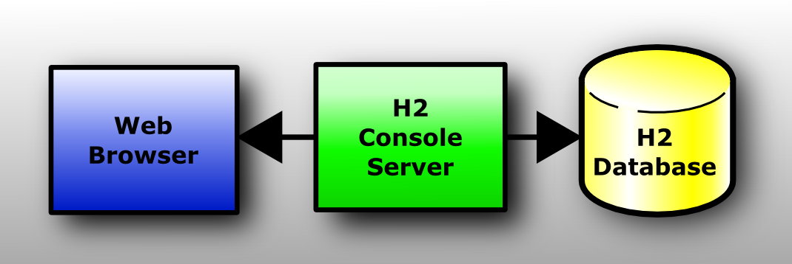
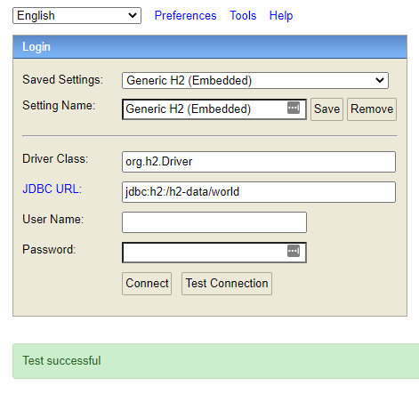
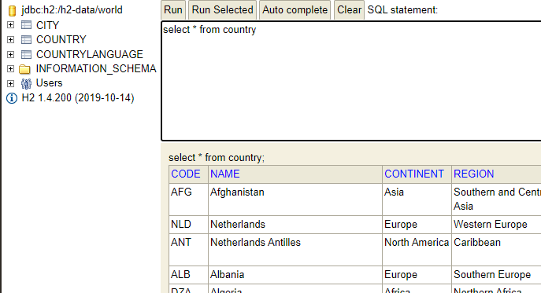

A low-level container in this application is a small database that contains world population data. You will use it as a read-only datastores providing the populations for the countries of the world, as well as the populations and locations of major cities. The [H2 database](https://www.h2database.com/html/main.html) is a classing relational database written in Java and runs in a container. The source of the data is old, therefore the numbers are lower than today's actual population.

The H2 database comes from a public container image and it needs to be seeded with the population data. Provided in this example is a SQL script that will seed a relational database, so we need to create an "initContainer" that will run next to the H2 container and seed it with the country and city population data when it starts. The InitContainer pattern is very common for ensuring Pods are in the correct state when started, especially datastores.

Move to the _h2-seeder_ directory.

`cd ~/cdc-with-k8s/h2-seeder`{{execute}}

## Build H2-seeder container image

Build the h2-seeder container using the provided Dockerfile and world.sql database. Take a look at the Dockerfile to see how when it runs is uses an H2 RunScript utility to inject the world.sql into the H2 database that is assumed to be local, in the same Pod.

Build and tag the h2-seeder container image.

`docker build -t localhost:5000/$(basename $PWD):0.0.1 .`{{execute}}

Push the container image to the private registry on your Kubernetes cluster.

`docker push localhost:5000/$(basename $PWD):0.0.1`{{execute}}

Inspect the registry to see the container image has been pushed.

`curl $REGISTRY/v2/_catalog | jq`{{execute}}

## Start H2 database

Apply this manifest declaration to set up a Pod and Service for H2. The h2-seeder is defined in the manifest as an initContainer.

`kubectl apply -f ../cluster/h2-world.yaml`{{execute}}

## Verify H2 database

It will take a moment for the broker Pods to be running. Check their status.

`kubectl get pods`{{execute}}

In a few moments, the Deployment will be available at a NodePort. Explore the [H2 database](
https://[[HOST_SUBDOMAIN]]-30100-[[KATACODA_HOST]].environments.katacoda.com/) and verify the population data is present. The H2 database serves a convenient web interface for you to interact with the database. When you are presented with the connection information just put in `jdbc:h2:/h2-data/world`{{copy}} for the JDBC driver URL and leave the username and password blank.

Use the Connect button to enter the SQL explorer. Enter `select * from country`{{copy}} to verify the database has been seeded.

