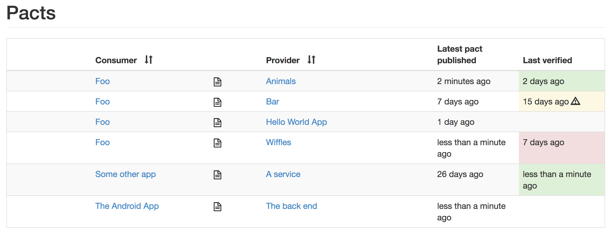

The Pact broker is the key that enables separation between the consumers and producers. The pact broker is a registry, or a library, that serves the collections of contacts generated by the consumers during mock testing and referenced by the producers during verification.

>The Pact Broker is an application for sharing for consumer driven contracts and verification results. It is optimised for use with "pacts" (contracts created by the Pact framework), but can be used for any type of contract that can be serialized to JSON. -[Pact Foundation](https://github.com/pact-foundation/pact_broker)

In this step, you will start the Pact Broker on Kubernetes. Move to the _cluster_ directory.

`cd ~/cdc-with-k8s/cluster`{{execute}}

There are two Kubernetes manifest files that declare the Deployments for the Pact Broker and its associated Postgres database. Apply these declarations.

`kubectl apply -f pact-broker-postgres.yaml`{{execute}}

`kubectl apply -f pact-broker.yaml`{{execute}}

The database is used for storing the Pacts and is attached to a Persistent Volume (PV) reserved in this cluster. In a production environment this persistence option can be further hardened.

Inspect the deployment, it may take a minute or two for the pact-broker Pod to report _Running_.

`kubectl get pods,deployments,services`{{execute}}

In a few moments, the new web interface will be available. Open the [Pact Broker web interface](
https://[[HOST_SUBDOMAIN]]-30111-[[KATACODA_HOST]].environments.katacoda.com/) and observe it's contents.

The broker is essentially empty. It does have an _Example App_, but this is just a sample. In a few moments, you will run a test on a consumer to generate and submit a new contact to this registry.
