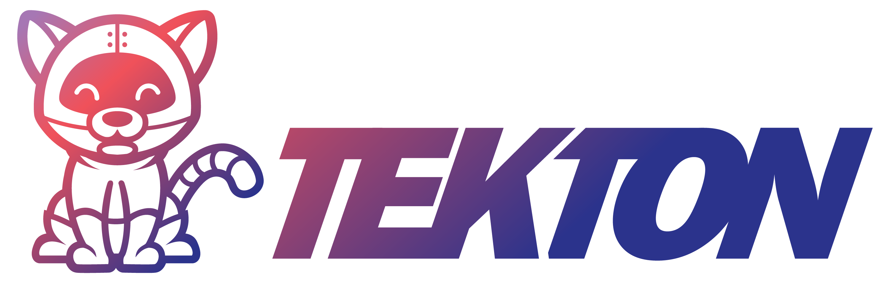

This scenario will take you through a recipe for delivering a microservice based on Python to Kubernetes. We look at a few effective techniques to package Python in an efficient container. Next, you create a CI/CD pipeline using Tekton, Kaniko is used in the pipeline to package a Python microservice in a container. The Tekton pipeline builds and delivers the application to Kubernetes.

The technologies you will touch are:

- Python microservice
- FastAPI with uvicorn
- Docker
- Kaniko
- Tekton
- Kubernetes

It's a lot to take in so take your time, and some tea, and settle in with this learning pathway.

The [Tekton Pipelines project](https://tekton.dev/) provides Kubernetes-style resources for declaring [CI](https://martinfowler.com/articles/continuousIntegration.html)/[CD](https://martinfowler.com/bliki/ContinuousDelivery.html) style pipelines.

Tekton is an open source project that formed as a subproject of the [Knative](https://knative.dev/) project in March of 2019. Using established Kubernetes style declarations, whole pipelines can be declared. The pipelines run on Kubernetes like any other process. Each step runs as an independent container. Tekton also helps normalize and standardize the terms and methods for forming and running pipelines. Tekton pipelines can complement a variety of popular CI/CD engines. For more information also see the [Continuous Delivery Foundation (CDF)](https://cd.foundation/).

> Tekton Pipelines is a Kubernetes extension that installs and runs on your Kubernetes cluster. It defines a set of Kubernetes Custom Resources that act as building blocks from which you can assemble CI/CD pipelines. Once installed, Tekton Pipelines becomes available via the Kubernetes CLI (kubectl) and API calls, just like pods and other resources. Tekton is open-source and part of the CD Foundation, a Linux Foundation project.
> [-- Tekton Project](https://tekton.dev/)

Within the pipeline is the Kaniko tool what builds OCI containers all within Kubernetes. Kaniko doesn't depend on a Docker daemon and references on Dockerfiles completely in a safe userspace.

You will learn:

- How to use FastAPI for developing a Python microservice
- How to distill a container that packages Python
- How to install a private registry with a UI
- How to define, run and observe a Tekton pipeline
- How to build a container with Kaniko
