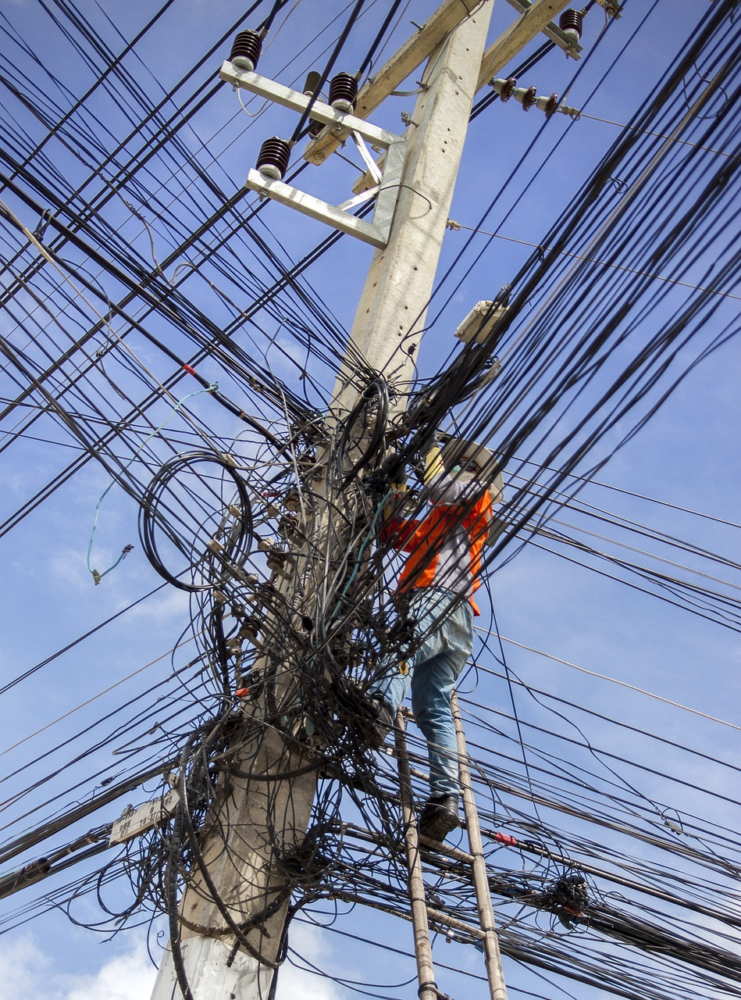

Pipeline tasks (and ClusterTasks) are entities that define a collection of sequential steps you would want to run as part of your continuous integration flow. A task will run inside a Pod on your cluster.

For our pipeline, we have defined two tasks:

1. **task-build-src** clones the source, builds the Node.js based container, and pushes the image to a registry.
2. **task-deploy** pulls the container image from the private registry and runs it on this Kubernetes cluster.

Inspect each task and see how it is composed of distinct, modular, and sequential steps.

`ccat pipeline/task-build-src.yaml`{{execute}}

`ccat pipeline/task-deploy.yaml`{{execute}}

Pods in Kubernetes are composed of one or more containers. Each Tekton task runs as a Kubernetes Pod. Each step in the task runs as a separate container in the task's Pod.

Everything the steps need is either in the containers or referenced as Tekton resources. Older CI/CD engines would rely on enormous plugins that were jammed into a global space on the engine. This led to many [anti-patterns](https://en.wikipedia.org/wiki/Anti-pattern) like `shoot the messenger` and `dependency hell`. This monolithic plugin ball of mud is avoided with Tekton by having each step be modular with atomic steps that contain all the details and dependencies to complete their sole responsibilities. Since a task is a Pod, you also are leveraging the distributed computing nature of Kubernetes and all the CPUs, memory, and I/O across your clustered machines.

Apply these task declarations:

Task name: _build-image-from-source_:

`kubectl apply -f pipeline/task-build-src.yaml`{{execute}}

Task name: _deploy-application_:

`kubectl apply -f pipeline/task-deploy.yaml`{{execute}}

Verify the tasks have been declared.

`tkn tasks list`{{execute}}
