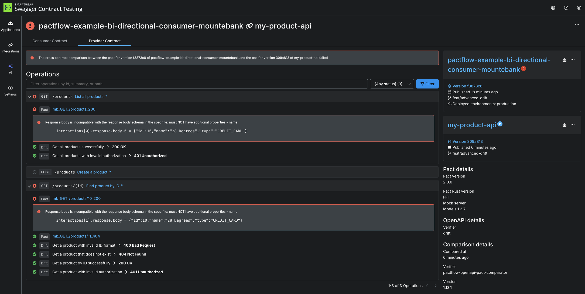

# When things go bad

So far everything has been really easy. Let's go a bit deeper and introduce a breaking change into the system. Breaking changes come in two main ways:

1. A consumer can add a new expectation (e.g. a new field/endpoint) on a provider that doesn't exist
1. A provider might make a change (e.g. remove or rename a field) that breaks an existing consumer

PactFlow will detect such situations using the `can-i-deploy` tool. When it runs, it performs a contract comparison that checks if the consumer contract is a valid subset of the provider contract in the target environment.

Let's see it in action.

## Provider breaking changes

Change directories into `cd /root/example-provider`{{execute}}

1.  Try adding a new expectation on the provider by updating the contract. First comment out the 'price' key `example-provider/src/product/product.js`{{copy}} and in the oas `example-provider/openapi.yaml`{{copy}} at lines 30/53/92/115/126/127

    1. `git add . && git commit -m 'feat: remove price'`{{execute}}
    2. Run the following command to publish, ensuring it is run after the test run `npm run test:inmemory`{{execute}} to capture the exit code

```
# Capture the exit code from Drift
EXIT_CODE=$?

# Find the generated verification bundle
VERIFICATION_FILE=$(ls output/results/verification.*.result | head -n 1)

pact pactflow publish-provider-contract \
openapi.yaml \
  --provider "my-product-api" \
  --provider-app-version "$(git rev-parse --short HEAD)" \
  --branch "$(git rev-parse --abbrev-ref HEAD)" \
  --content-type application/yaml \
  --verification-exit-code $EXIT_CODE \
  --verification-results "$VERIFICATION_FILE" \
  --verification-results-content-type application/vnd.smartbear.drift.result \
  --verifier drift
```{{execute}}

    3. Run Can I Deploy to check if it's safe to deploy this change to production:

```
pact broker can-i-deploy \
  --pacticipant "my-product-api" \
    --version "$(git rev-parse --short HEAD)" \
    --to-environment production
```{{execute}}

    OK, that was a trick! Note how in the consumer's `Product` definition, it doesn't actually use the `price` field? PactFlow knows all of the consumers needs down to the field level. Because no consumer uses `price` this is a safe operation.

    Reset our change `git reset --hard origin/master`{{execute}}

2.  Try changing the provider code in a way that will break it's existing consumer. For example, comment out all references to `name` in `example-provider/src/product/product.js`{{copy}} and in the oas `example-provider/openapi.yaml`{{copy}} at lines 31/54/93/114/122/123

    1. `git add . && git commit -m 'feat: remove name'`{{execute}}
    2. Run the following command to publish, ensuring it is run after the test run `npm run test:inmemory`{{execute}} to capture the exit code

```
# Capture the exit code from Drift
EXIT_CODE=$?

# Find the generated verification bundle
VERIFICATION_FILE=$(ls output/results/verification.*.result | head -n 1)

pact pactflow publish-provider-contract \
openapi.yaml \
  --provider "my-product-api" \
  --provider-app-version "$(git rev-parse --short HEAD)" \
  --branch "$(git rev-parse --abbrev-ref HEAD)" \
  --content-type application/yaml \
  --verification-exit-code $EXIT_CODE \
  --verification-results "$VERIFICATION_FILE" \
  --verification-results-content-type application/vnd.smartbear.drift.result \
  --verifier drift
```{{execute}}

    3. Run Can I Deploy to check if it's safe to deploy this change to production:

```
pact broker can-i-deploy \
  --pacticipant "my-product-api" \
    --version "$(git rev-parse --short HEAD)" \
    --to-environment production
```{{execute}}

    You should have an output like below

```
✗ npm run can-i-deploy

> product-service@1.0.0 can-i-deploy /Users/matthewfellows/development/public/my-product-api
> pact-broker can-i-deploy --pacticipant my-product-api --version "$(git rev-parse --short HEAD)" --to-environment production

npx: installed 47 in 1.509s
Computer says no ¯_(ツ)_/¯

CONSUMER                             | C.VERSION          | PROVIDER                        | P.VERSION                                | SUCCESS? | RESULT#
-------------------------------------|--------------------|---------------------------------|------------------------------------------|----------|--------
pactflow-example-bi-directional-consumer-mountebank | 5009e94+1645930887 | my-product-api | aec911-master+aec911.SNAPSHOT.Matts-iMac | false    | 1

VERIFICATION RESULTS
--------------------
1. https://testdemo.pactflow.io/hal-browser/browser.html#https://testdemo.pactflow.io/contracts/provider/pactflow-example-bi-directional-provider-dredd/version/aec911-master%2Baec911.SNAPSHOT.Matts-iMac/consumer/pactflow-example-bi-directional-consumer-mountebank/pact-version/908c12f39ad2e9d9b31ff82a367f6e68368344b3/verification-results (failure)

The cross contract verification between the pact for the version of pactflow-example-bi-directional-consumer-mountebank currently deployed to production (5009e94+1645930887) and the oas for version aec911-master+aec911.SNAPSHOT.Matts-iMac of pactflow-example-bi-directional-provider-dredd failed
```

Head into the PactFlow UI and drill down into the "contract comparison" tab, you'll see the output from comparing the consumer and provider contracts:



As you can see, it's alerting us to the fact that the consumer needs a field `name` but the provider doesn't support it.

Read more about how to [interpret failures](https://docs.pactflow.io/docs/bi-directional-contract-testing/compatibility-checks).

## Consumer breaking changes

Change directories into your consumer project: `cd /root/example-bi-directional-consumer-mountebank`{{execute}}

1.  Try adding a new expectation on the provider by updating the contract. For example, add a new property to the `expectedProduct` field in `example-bi-directional-consumer-mountebank/src/api.spec.js`{{copy}}:

    ```
    const expectedProduct = {
        id: "10",
        type: "CREDIT_CARD",
        name: "28 Degrees",
        foo: "bar"
    };
    ```

    1. `git add . && git commit -m 'feat: add foo'`{{execute}}
    2. `npm t`{{execute}}
    3. Publish the pact files

```
pact broker publish \
pacts \
  --consumer-app-version "$(git rev-parse --short HEAD)" \
  --branch "$(git rev-parse --abbrev-ref HEAD)"
```{{execute}}


    4. Run Can I Deploy to check if it's safe to deploy this change to production:

```
pact broker can-i-deploy \
  --pacticipant "pactflow-example-bi-directional-consumer-mountebank" \
    --version "$(git rev-parse --short HEAD)" \
    --to-environment production
```{{execute}}


    You shouldn't be able to deploy!

```
✗ npm run can-i-deploy

> consumer@0.1.0 can-i-deploy /Users/matthewfellows/development/public/pactflow-example-bi-directional-consumer-mountebank
> pact-broker can-i-deploy --pacticipant pactflow-example-bi-directional-consumer-mountebank --version="$(npx @pact-foundation/absolute-version)" --to-environment production

npx: installed 47 in 2.64s
Computer says no ¯_(ツ)_/¯

CONSUMER                             | C.VERSION                                | PROVIDER                        | P.VERSION          | SUCCESS? | RESULT#
-------------------------------------|------------------------------------------|---------------------------------|--------------------|----------|--------
pactflow-example-bi-directional-consumer-mountebank | 009e94-master+009e94.SNAPSHOT.Matts-iMac | my-product-api | caec911+1645930967 | false    | 1

VERIFICATION RESULTS
--------------------
1. https://testdemo.pactflow.io/hal-browser/browser.html#https://testdemo.pactflow.io/contracts/provider/pactflow-example-bi-directional-provider-dredd/version/caec911%2B1645930967/consumer/pactflow-example-bi-directional-consumer-mountebank/pact-version/a34e535ec10e8c1fd04202ae4b9d3943b780c332/verification-results (failure)

The cross contract verification between the pact for version 009e94-master+009e94.SNAPSHOT.Matts-iMac of pactflow-example-bi-directional-consumer-mountebank and the oas for the version of pactflow-example-bi-directional-provider-dredd currently deployed to production (caec911+1645930967) failed
```

As per the previous failure, you can see it's alerting us to the fact that the consumer needs a field `colour` but the provider doesn't support it.

The consumer won't be able to release this change until the Provider API supports it.

## Check your understanding

1. It is always safe to remove a field from a provider, if no consumers are currently using it
1. It is not safe to remove a field/endpoint from a provider, if an existing consumer _is_ using it, and PactFlow will detect this situation.
1. PactFlow will prevent a consumer from deploying a change that a Provider has yet to support

