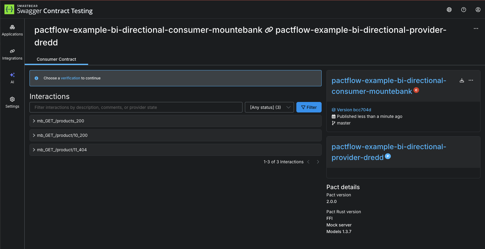

# Publish consumer contract to PactFlow

Now that we have created our consumer contract, we need to share it to our provider. This is where PactFlow comes in to the picture. This step is referred to as "publishing" the consumer contract.

As per step 4, we're going to need credentials to our PactFlow account here:

_NOTE: if step 1 and 2 return a value you can move to step 5

1. `echo $PACT_BROKER_BASE_URL`{{execute}}  
2. `echo $PACT_BROKER_TOKEN`{{execute}} 
3. Go to PactFlow and copy your [read/write API Token](https://docs.pactflow.io/#configuring-your-api-token)
4. Export these two environment variables into the terminal, being careful to replace the placeholders with your own values:

   ```
   export PACT_BROKER_BASE_URL=https://YOUR_PACTFLOW_SUBDOMAIN.pactflow.io
   export PACT_BROKER_TOKEN=YOUR_API_TOKEN
   ```

5. Publish the pact files

```
# Capture the exit code from Drift
EXIT_CODE=$?

# Find the generated verification bundle
VERIFICATION_FILE=$(ls output/results/verification.*.result | head -n 1)

pact broker publish \
pacts \
  --consumer-app-version "$(git rev-parse --short HEAD)" \
  --branch "$(git rev-parse --abbrev-ref HEAD)"
```{{execute}}

You should see output similar to this:

```
📨 Attempting to publish pact for consumer: pactflow-example-bi-directional-consumer-mountebank against provider: pactflow-example-bi-directional-provider-dredd
✅ Created pactflow-example-bi-directional-consumer-mountebank version bcc704d with branch master
Pact successfully published for pactflow-example-bi-directional-consumer-mountebank version bcc704d and provider pactflow-example-bi-directional-provider-dredd.
View the published pact at https://test.pactflow.io/pacts/provider/pactflow-example-bi-directional-provider-dredd/consumer/pactflow-example-bi-directional-consumer-mountebank/version/bcc704d
Events detected: contract_published, contract_requiring_verification_published, contract_content_changed (pact content has changed since previous untagged version)
No enabled webhooks found for the detected events
Next steps:
* Add Pact verification tests to the pactflow-example-bi-directional-provider-dredd build. See https://docs.pact.io/go/provider_verification
```

1. Go to your PactFlow dashboard and check that a new contract has appeared

Your dashboard should look something like this:



## Don't have a PactFlow account?

If you don't have a PactFlow account, you can publish a [test broker](https://test.pactflow.io).

```
export PACT_BROKER_BASE_URL=https://test.pactflow.io
export PACT_BROKER_TOKEN=129cCdfCWhMzcC9pFwb4bw
```{{execute}}

If you use this account, note that you won't have access to the UI.

## Check

There should be a contract published in your PactFlow account before moving on.